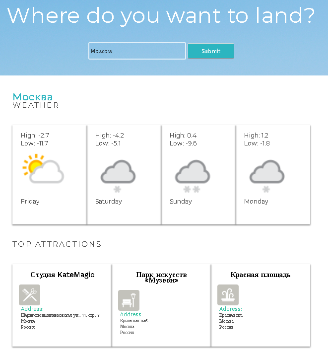

## js AJAX Wanderlust

Using `async` `await` to implement 2 `API`'s:

- [Apixu API](https://www.apixu.com/)
- [Foursquare API](https://ru.foursquare.com)

**Apixu** provides access to weather and geo data via a JSON/XML restful API.

**Foursquare**, is a local search-and-discovery mobile app which provides search results for its users.

