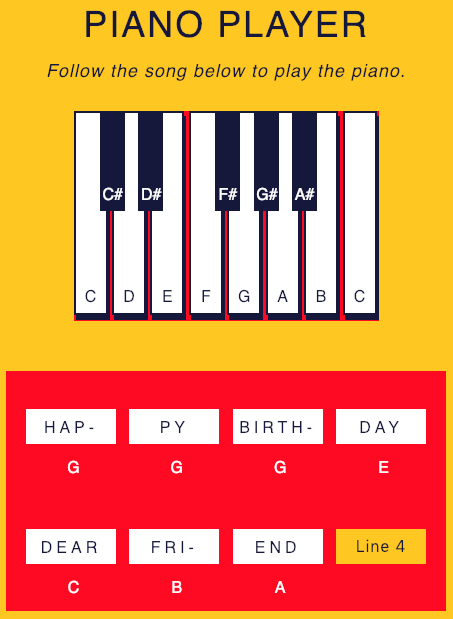

<h1>Piano Player</h1>

Using JavaScript and DOM events to create piano player with notes

<li>getElementById</li>
<li>innerHTML</li>
<li>style</li>
<li>hidden</li>
<li>target</li>
<li>onmouseup/down</li>

 