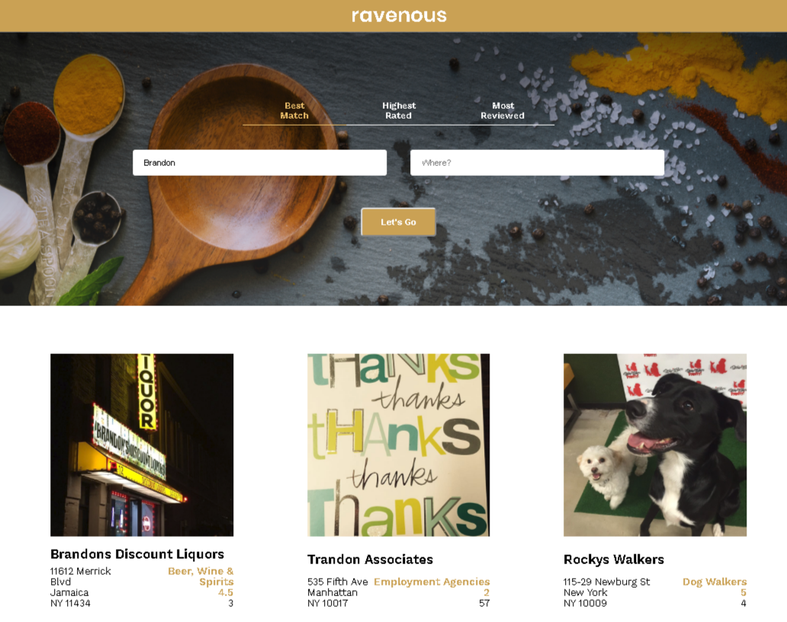

## Ravenous

1 page React app tutorial with Yelp API.
You pass the name of the place and where it is located, then Yelp API provides you the info of best places around.
You can also sort list by "best match", "highest rated" and "most reviewed".

### What used here?
- node 
- npm
- react
- whatwg-fetch
- css - flex

### How to install

1. Clone or download to your computer;
2. Open terminal and `npm install -g create-react-app`;
3. Navigate terminal to install dir;
4. `npm install` to install necessary dependancies;
5. `npm start` to run server.